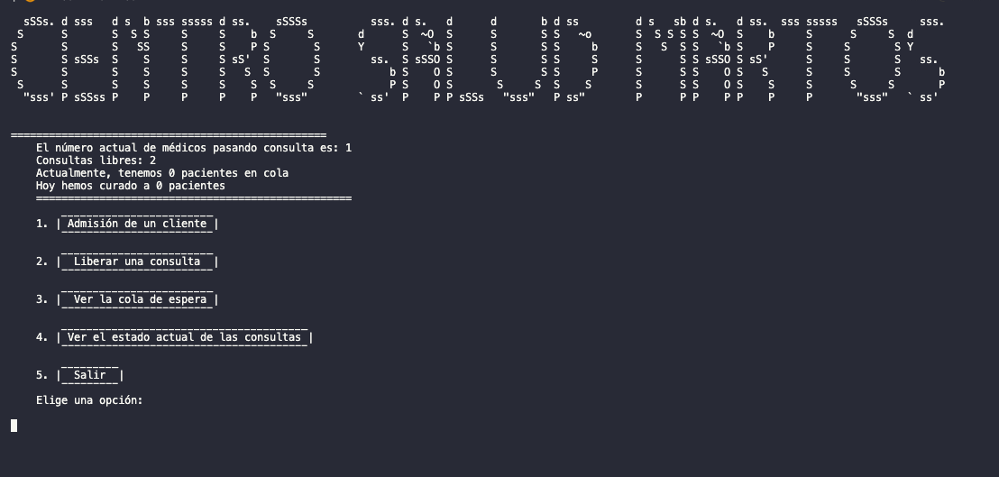

# Gestión Salud

### Aplicación en consola hecho en Dart y FireBase

---

- Esta aplicación controla la admisión de pacientes los cuales son registrados, si hay consultas disponibles estos son ingresados a consultas, sino son añadidos a una lista espera. Además se puede liberar consultas, ver la lista de espera y ver los estados de las consultas.
- A continuación el resultado de cómo se ve en la consola.

- Si te gusto la aplicación dale star y si deseas aportar también puedes hacerlo. Espero que les guste

Autores:

- [Flavio Oria](https://github.com/flaviooria)
- [Manuel Rodriguez](https://github.com/ManuRQCoding)

